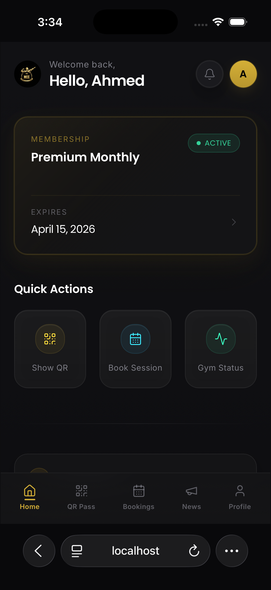
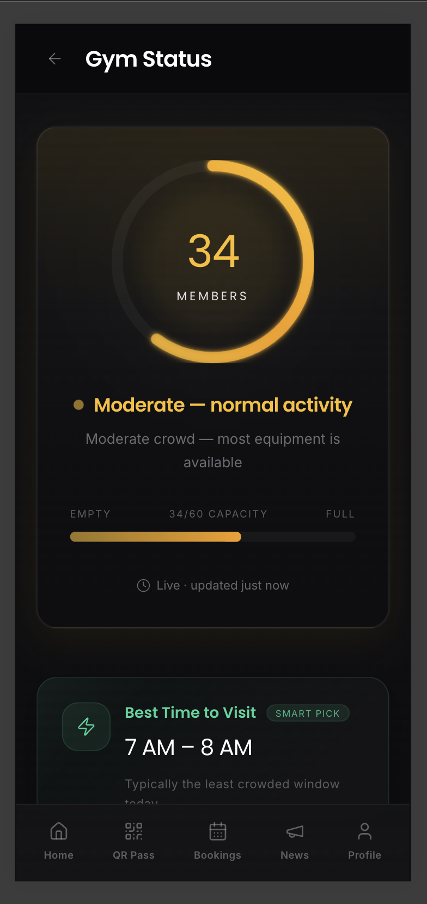
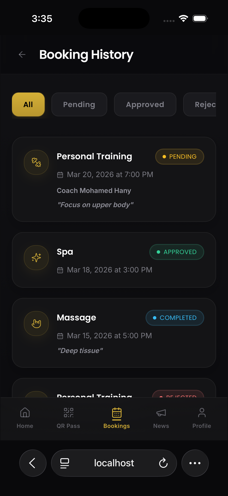
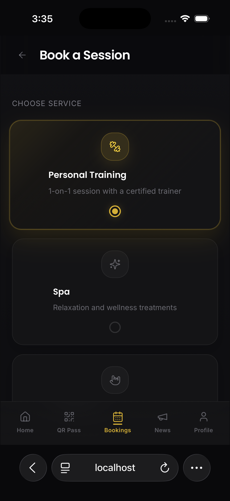
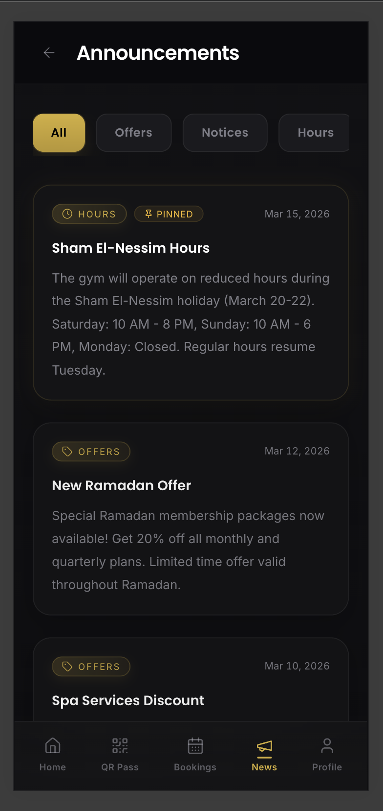
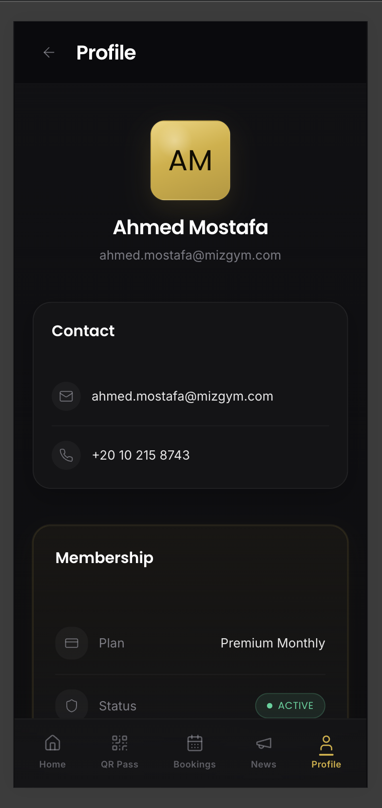
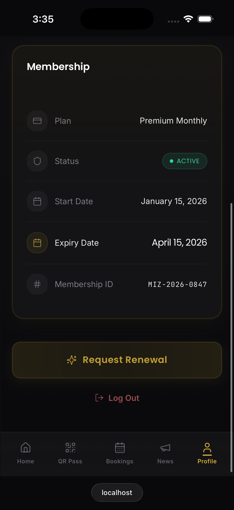
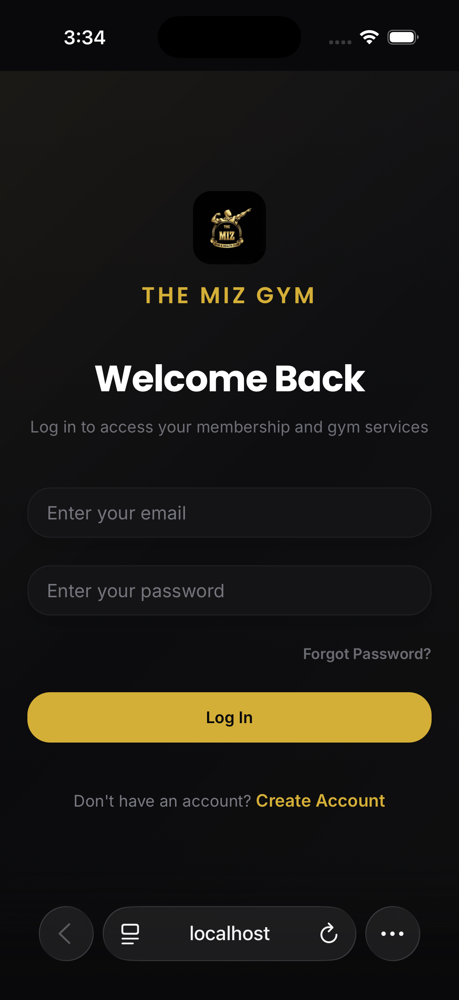
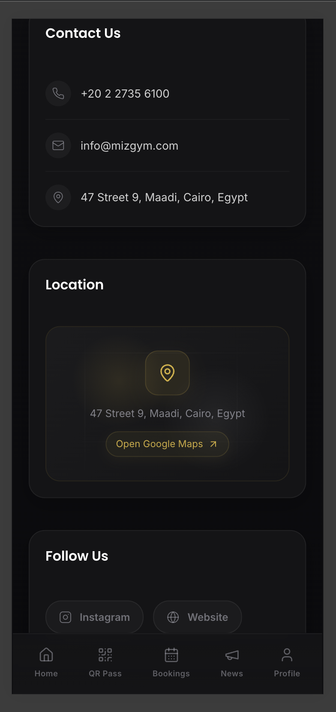

# 🏋️ MIZ Gym App

## 📖 Overview

MIZ Gym App is a frontend-only gym management experience built to simulate a real mobile fitness platform. It helps gyms and members manage everyday interactions digitally, from entry access and membership visibility to bookings, announcements, and live crowd awareness.

---

## 🎥 Demo

<p align="center">
  
</p>

This demo showcases the main app flow and user experience.

---

## ✨ Features

- Digital membership tracking
- QR code entry system
- Session booking system
- Gym crowd status monitoring
- Announcements and offers
- User profile management

---

## 📱 Screenshots

### Dashboard & Status

<p align="center">
  
  
</p>

<br/>

### Booking & QR

<p align="center">
  
  
</p>

<p align="center">
  
  
</p>

<br/>

### Profile & Info

<p align="center">
  
  
</p>

<p align="center">
  
  
</p>

---

## 🛠 Tech Stack

- React
- Vite
- Tailwind CSS
- TypeScript

---

## 🚀 Getting Started

1. Clone the repo
2. Install dependencies:
   ```bash
   npm install
   ```
3. Run the app:
   ```bash
   npm run dev
   ```

---

## 🔮 Future Improvements

- Backend integration (Node.js / Django)
- Authentication system
- Real-time gym occupancy tracking
- Push notifications
- Mobile app version (Flutter or React Native)

---

## 👨‍💻 Author

Built by the MIZ Gym App project author.
